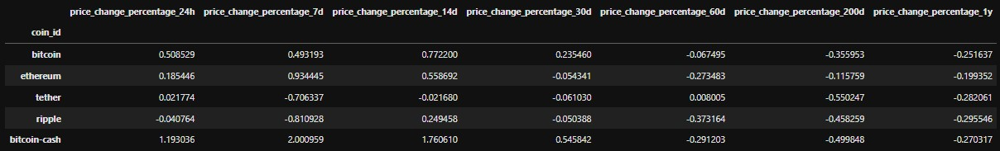
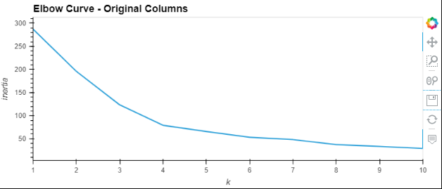
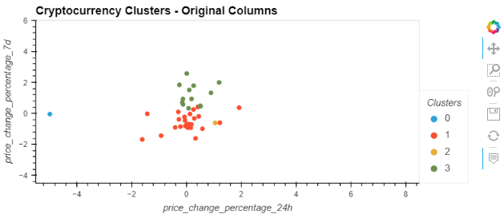
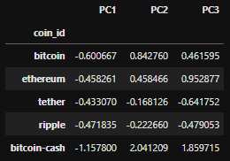
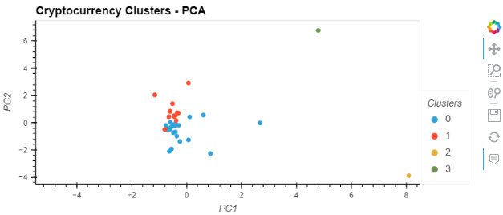

# Crypto Clustering

## Overview and Purpose
This project uses the K-Means machine learning algorithm to group different cryptocurrencies based on price trends. I will be fitting the algorithm to two different DataFrames: the original DataFrame which contains 7 columns of data, and a DataFrame generated by applying Principal Component Analysis (PCA) to the original DataFrame. This condensed DataFrame will contain 3 columns of data. It is the weekly challenge for module 10 of the UW Fintech Boot Camp: Unsupervised Learning.

The purpose of this project is to demonstrate application of the Principal Component Analysis technique, the K-Means algorithm, and data scaling using the Python Scikit-learn library.

---

## Process

### Scaling the Data
Before we can use the K-Means algorithm, we must first scale the data. To do this, I used StandardScaler from Scikit-learn to ensure all of the data was at the same scale.

```
# Use the `StandardScaler()` module from scikit-learn to normalize the data from the CSV file
scaled_data = StandardScaler().fit_transform(df_market_data)

# Create a DataFrame with the scaled data
df_market_data_scaled = pd.DataFrame(
    scaled_data,
    columns=df_market_data.columns
)

# Copy the crypto names from the original data
df_market_data_scaled["coin_id"] = df_market_data.index

# Set the coinid column as index
df_market_data_scaled = df_market_data_scaled.set_index("coin_id")

# Display sample data
df_market_data_scaled.head()

```

This code results in the following DataFrame:



### Using the Elbow Method to find the best value for `k`
To find the optimal number of centroids for the K-Means algorithm, I used the Elbow Method. This method calculates the inertia, or distance between data points, of the clusters for different numbers of centroids. By plotting the inertia, we can determine the optimal value for `k` by observing the point at which the difference in inertia between number of centroids begins to stabilize.

```
for k in k_values:
    k_model = KMeans(n_clusters=k, random_state=1)
    k_model.fit(df_market_data_scaled)
    inertia.append(k_model.inertia_)
    
# Create a dictionary with the data to plot the Elbow curve
elbow_data = {'k':k_values, 'inertia':inertia}

# Create a DataFrame with the data to plot the Elbow curve
df_elbow = pd.DataFrame(elbow_data)

# Plot a line chart with all the inertia values computed with 
# the different values of k to visually identify the optimal value for k.
elbow_plot = df_elbow.hvplot(
    x='k',
    y='inertia',
    title='Elbow Curve - Original Columns',
    xticks=list(k_values)
)
elbow_plot
```



Observing the elbow curve, we can determine that the optimal number for `k` in our dataset is 4.

## Cluster Cryptocurrencies with K-means Using the Original Data

Now that we have determined the optimal value for `k`, we can run our data through the algorithm. 

```
# Initialize the K-Means model using the best value for k
model = KMeans(n_clusters=4, random_state=1)

# Fit the K-Means model using the scaled data
model.fit(df_market_data_scaled)

# Predict the clusters to group the cryptocurrencies using the scaled data
crypto_clusters = model.predict(df_market_data_scaled)

# Add a new column to the DataFrame with the predicted clusters
df_market_data_predictions['Clusters'] = crypto_clusters

crypto_clusters_plot = df_market_data_predictions.hvplot.scatter(
    x='price_change_percentage_24h',
    y='price_change_percentage_7d',
    by='Clusters',
    hover_cols='coin_id',
    title='Cryptocurrency Clusters - Original Columns',
    xlim=(-5.5, 8.5),
    ylim=(-4.5, 6)
)

crypto_clusters_plot
```



## Optimize Clusters with Principal Component Analysis
This section takes the original data and attempts to optimize it using Principal Component Analysis, reducing the number of features of the data from 7 to 3.

```
# Create a PCA model instance and set `n_components=3`.
pca = PCA(n_components=3)

# Use the PCA model with `fit_transform` to reduce to three principal components.
crypto_pca_data = pca.fit_transform(df_market_data_scaled)

# Retrieve the explained variance to determine how much information can be attributed to each principal component.
pca.explained_variance_ratio_
```

The following DataFrame shows the results of the PCA:



I then followed the same process for the PCA data as I did with original data, calculating the best value for `k`, running the K-Means algorithm, and plotting the results:



Comparing the scatter plot of the original data with that of the PCA data, I made a few observations:

Between the two plots, the x-axis values seemed to change more than the y-axis values. In the PCA plot, the clusters containing most of the data points appear to be slightly lower on the x axis overall, but similar on the y-axis. In general these two larger clusters did not seem to change all that much. The biggest change appears to be in the outlier clusters. 

In both plots, two of the coins, ethlend and celsius degree token were the only coins in their respective clusters, but their positions on the chart changed dramatically after the PCA. For example in the original chart, ethlend was at -4.981 on the x axis, whereas in the PCA chart it was at 8.089 on the x axis. However this could be because in the original chart the x axis reflected the 24 hour change, which is a very limited representation of the data overall. I would guess that this is why the x-axis values changed more than the y-axis values, since the y-axis represents the 7 day change, which is a better indicator of the overall trend.
  
Using PCA makes it easier to analyze how the different coins were clustered across all of their features, rather than just looking at 2 features at a time which could lead to a skewed analysis. The PCA model generated represented nearly 90% of the total data, which is pretty good considering we condensed the seven features in the original DataFrame to 3 principal components.

---

## Technologies

* Python 3.9
* Jupyter Lab and Jupyter Notebooks
* Python libraries: Pandas, Holoviews, Pathlib, Scikit-learn
* K-Means machine learning algorithm
* Principal Component Analysis
* Elbow Method

---

## Contributors
Lydia Ciummo - lydiaciummo@hotmail.com

---

## License
GNU General Public License v3.0